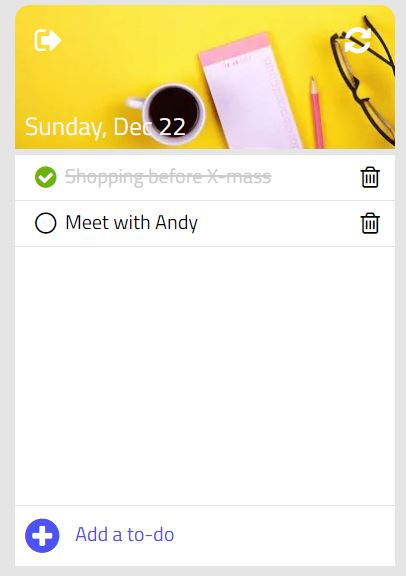
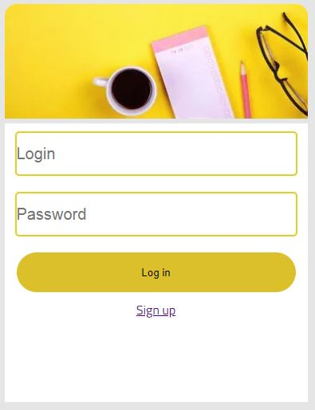
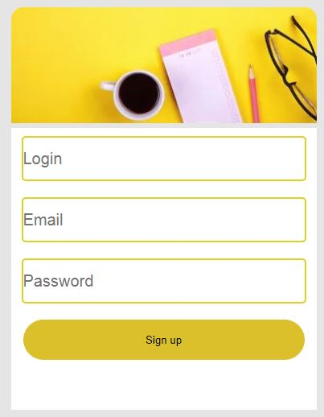

# Projekt IV - To do
Aplikacja umożliwia użytkownikowi tworzenie listy rzeczy do zrobienia. Elementy dodaje sie poprzez wpisanie ich w polu "Add a to-do" oraz zatwierdzeniu klikając w plus znajdujący sie po lewej stronie lub wciskająć enter. Jeżeli użytkownik wykonał jakąś rzecz z listy może ją z niej wykreślić zaznaczając dostępne przy niej kółko. Usuwanie danej pozycji jest możliwe po kliknięciu ikony kosza.

## Uruchomienie serwera i połączenie z bazą danych

### 1. Wejście do katalogu z projektem
cd <sciezka_do_pliku>
### 2. Instalacja npm 
install npm
### 3. Ustawienie klucza
set projektIV_jwtPrivateKey= mySecureKey
### 4. Automatyczne uruchamianie aplikacji
nodemon index.js

## Logowanie 
Aby zalogować się do aplikacji należy podać adres e-mail oraz hasło podane w czasie rejestracji. Jeżeli użytkownik nie ma jeszcze konta może stworzyć je klikająć w napis "Sign up".

## Rejestracja 
Rejestrująć się wymagane jest podanie nazwy użytkownika, adresu e-mail oraz hasła, które musi zawierać przynajmniej jeden znak specjalny i cyfrę.  

# Demo 
Aplikacja po stronie klienta dostępna po włączeniu w programie Live Server: http://localhost:5500/logIn.html

Aplikacja po stronie serwera: http://localhost:3000

## Do stworzenia projektu zastosowano m.in.:
* HTML5
* CSS3
* JavaScript
* Node.js
* Express.js 
* MongoDB 
